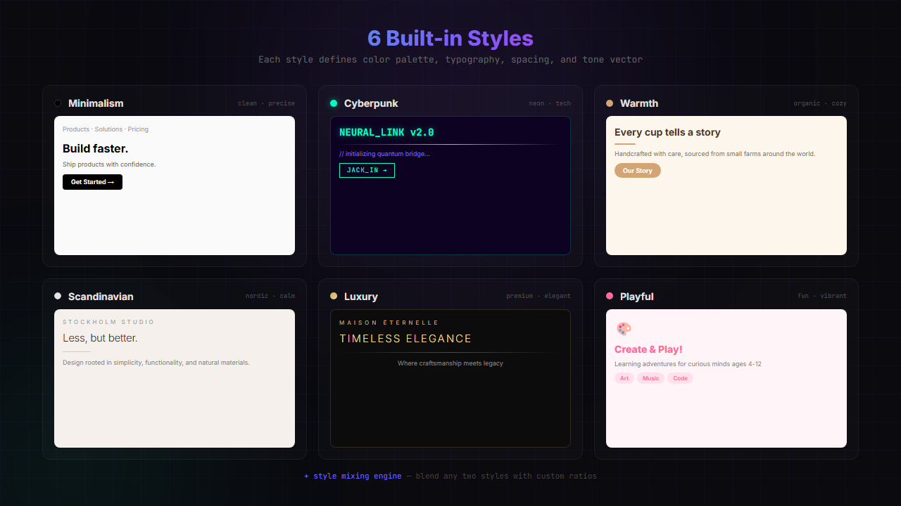

# DesignSeed 🌱

> 🌱 This is a **Vibe Coding** project: Built with AI, for AI-augmented development.


<p align="center"><b>English</b> | <a href="README.md">中文</a></p>

<p align=center>
  
</p>

**DesignSeed** is a growing AI design system — an Agent-first HTML design engine that gives AI assistants "aesthetic" capabilities.

Its core value: **making AI-generated pages no longer monotonous black-on-white, but design works with style, tone, and memory.**

---

<p align="center">
  
</p>

## ✨ Core Features

### Foundation

| Feature | Description |
|---------|-------------|
| 🎨 **12 Built-in Styles + Mixing Engine** | Minimalism, neumorphism, glassmorphism, etc. — mix any two styles at custom ratios |
| 🏢 **15 Seed Design Systems** | Stripe, Vercel, Apple, Linear, Notion, Figma, Spotify, Airbnb, GitHub, Slack, Netflix, Tesla, Claude, Supabase, Raycast |
| 🕷️ **Design Crawler** | Learn from GitHub repos, company design systems, and design blogs — extract color/typography/layout/tone features |
| 🧠 **Embedded Memory** | SQLite storage, EMA preference learning, design preference profiles |
| 🛡️ **Aesthetic Rules Engine** | 7 built-in rules (contrast/font/line-width/color/ugly-combo/spacing/border-radius) |
| 📦 **Self-contained Skill** | Unzip and use, no external services needed |
| 🔄 **Bidirectional Sync** | Export as knowledge packs, import to other agents or devices |

### v0.3

| Feature | Description |
|---------|-------------|
| 📱 **Device Frames** | iOS (iPhone 16 Pro/SE/iPad) + Android (Pixel 9 Pro/Samsung S24/Xiaomi 15) pixel-perfect frames |
| 🖥️ **Complex UI Layouts** | Dashboard / Editor / Workshop / Settings / List / Detail — 6 professional layout modes |
| ⚡ **Interaction States** | Tab switching / Accordion / Modal / Toast / Dropdown (pure CSS) |
| 🖼️ **Real Image Sourcing** | Wikimedia Commons + Unsplash API — semantic image search, no more placeholders |
| 🏷️ **Brand Asset Protocol** | 5-step hard process for logos/product images/UI screenshots |
| 💡 **Design Direction Advisor** | 20+ design philosophies (Pentagram/Field.io/Kenya Hara/Sagmeister, etc.) |
| 🔍 **Expert Review Engine** | 5-dimension scoring + fix checklist |
| 🚫 **Anti AI Slop** | 10 check rules to prevent "AI-flavored" design |

### v0.4

| Feature | Description |
|---------|-------------|
| 📄 **design.md Format** | YAML frontmatter + Markdown sections for standardized design system descriptions |
| 🔗 **Design System Bridge** | design.md → renderer auto-conversion, 17 seed design systems |
| 🕷️ **CSS Variable Extractor** | Extract custom properties from CSS/HTML/JSX, map to design token semantics |
| 🧩 **Component Library Detector** | Auto-detect 12 UI frameworks (Tailwind/Bootstrap/MUI/Ant Design, etc.) |
| 🎯 **End-to-End Demo** | `node demo.js "requirement" --style stripe` — one command generates complete HTML |

### v0.5

| Feature | Description |
|---------|-------------|
| 🔄 **3-Channel Feedback** | User scoring + behavior inference + A/B comparison |
| 📊 **User Preference Profile** | 6-dimension profile with confidence scores |
| 🧬 **Rule Self-Adaptation** | Accept rate ↑ → weight ↑, overridden → weight ↓, unused → decay |
| 🔀 **Cross-System Style Mixing** | Built-in × learned styles with auto-recommended ratios |
| 📦 **Batch Learning Pipeline** | Incremental learning + quality filtering + dedup |

### 🆕 v0.6

<p align="center">
  
</p>

| Feature | Description |
|---------|-------------|
| 🌳 **DesignTree Data Structure** | DesignNode → DesignTree → DesignProject — standardized design output |
| 🧩 **20+ Component Templates** | Navbar, Hero, Features, Pricing, FAQ, Timeline, Gallery, Subscribe, Team, CTA, etc. |
| 📐 **Responsive Layout Engine** | Auto-detect Grid/Flex, generate 768px/480px breakpoints |
| 🔌 **COVE Protocol** | 10 standardized interfaces: createProject / parseIntent / generateTree / renderHTML / renderPreview / listStyles / mixStyles / listComponents / getNode / updateNode |
| 🧠 **Intent Parser** | Natural language → structured design intent (page type + components + style), 10+ page types |
| 🎨 **6 Style Engines** | minimalism / cyberpunk / warmth / scandinavian / luxury / playful with full tone vectors |

**v0.6 Breakthrough**: Upgraded from "one-shot HTML generation" to "structured DesignTree → dual HTML output", laying the foundation for GUI canvas editing and NightShift integration.

---

## 🏗️ Architecture

```
DesignSeed/
├── engine/              # 🎨 HTML Design Engine
│   ├── cli.js           #   CLI Entry
│   ├── renderer.js      #   Prompt → HTML Renderer
│   ├── tree-renderer.js #   🌳 DesignNode → HTML Renderer (v0.6)
│   ├── mixer.js         #   Style Mixing Engine (vector interpolation)
│   ├── seed-design-systems.js  # 15 Seed Design Systems
│   ├── device-frames.js #   📱 Device Frames
│   ├── layouts.js       #   🖥️ Complex UI Layouts
│   ├── interactions.js  #   ⚡ Interaction States
│   ├── image-sourcing.js#   🖼️ Real Image Sourcing
│   ├── brand-protocol.js#   🏷️ Brand Asset Protocol
│   ├── design-philosophy.js # 💡 Design Direction Advisor
│   ├── expert-review.js #   🔍 Expert Review Engine
│   ├── anti-ai-slop.js  #   🚫 Anti AI Slop
│   ├── intent-parser.js #   🧠 Intent Parser (v0.6)
│   ├── component-library.js # 🧩 Component Templates (v0.6)
│   ├── layout-engine.js #   📐 Responsive Layout Engine (v0.6)
│   ├── style-engine.js  #   🎨 Style Engine (v0.6)
│   ├── cove-protocol.js #   🔌 COVE Protocol (v0.6)
│   ├── templates/       #   12 Style Definitions
│   └── components/      #   Base UI Component Library
├── crawler/             # 🕷️ Design Crawler
├── memory/              # 🧠 Embedded Memory
├── rules/               # 🛡️ Aesthetic Rules Engine
├── sync/                # 🔄 Sync Layer
└── SKILL.md             # Agent Skill Documentation
```

---

## 🚀 Quick Start

DesignSeed is an AI skill. Just tell the AI what you want in natural language.

### Generate App Prototypes

> "Make a task management app interface, shown in an iPhone 16 Pro frame"

> "Generate a data analytics dashboard with sidebar and stat cards"

### Style Mixing

> "Make a landing page with a style between minimalism and glassmorphism"

> "Use Stripe's style for a pricing page, but change colors to green"

### Design Review

> "Check the design quality of this page"

> "Does this page have too much AI flavor?"

---

## 📱 Device Frames

| Platform | Model | Size | Features |
|----------|-------|------|----------|
| **iOS** | iPhone 16 Pro | 393×852 | Dynamic Island |
| **iOS** | iPhone SE | 375×667 | Classic bezels |
| **iOS** | iPad Pro | 1024×768 | Narrow bezels |
| **Android** | Pixel 9 Pro | 412×915 | Pill cutout |
| **Android** | Samsung S24 | 360×780 | Circle cutout |
| **Android** | Xiaomi 15 | 400×880 | Circle cutout |

---

## 🏢 Seed Design Systems

| System | Primary | Tone Tags |
|--------|---------|-----------|
| **Stripe** | `#635BFF` | Professional · Finance · Developer |
| **Vercel** | `#000000` | Minimal · Developer · Dark |
| **Apple** | `#0071E3` | Premium · Minimal · Refined |
| **Linear** | `#5E6AD2` | Modern · Efficient · Professional |
| **Notion** | `#000000` | Minimal · Flexible · Knowledge |
| **Figma** | `#A259FF` | Creative · Collaborative · Design |
| **Spotify** | `#1DB954` | Playful · Entertainment · Social |
| **Airbnb** | `#FF5A5F` | Warm · Travel · Community |
| **GitHub** | `#24292E` | Professional · Developer · Open Source |
| **Slack** | `#4A154B` | Friendly · Collaborative · Enterprise |
| **Netflix** | `#E50914` | Entertainment · Film · Dark |
| **Tesla** | `#CC0000` | Tech · Future · Premium |
| **Claude** | `#D97757` | Professional · AI · Reliable |
| **Supabase** | `#3ECF8E` | Developer · Modern · Open Source |
| **Raycast** | `#FF6363` | Efficiency · Tool · Geek |

---

## 🛡️ Aesthetic Rules Engine

| Rule | Type | Description |
|------|------|-------------|
| `accessibility_contrast` | hard_limit | Text contrast ≥ 4.5:1 (WCAG 2.1 AA) |
| `min_font_size` | hard_limit | Minimum font size ≥ 12px |
| `max_line_length` | soft_preference | Line width ≤ 80 characters |
| `color_harmony` | hard_limit | Max 7 primary colors |
| `ugly_combo_clash` | hard_limit | High-saturation clash prevention |
| `spacing_consistency` | soft_preference | 4/8px grid system |
| `border_radius_consistency` | soft_preference | Standard radius scale |

---

## 🗺️ Roadmap

<p align="center">
  
</p>

### v0.1 ✅ — MVP Core
- [x] HTML Design Engine: 12 styles, Prompt → HTML
- [x] Design Crawler: multi-source scraping, feature extraction
- [x] Embedded Memory: SQLite storage, EMA preference learning
- [x] Aesthetic Rules Engine: 7 built-in rules

### v0.2 ✅ — Style Mixing + Knowledge
- [x] Vector space style interpolation
- [x] 15 head design system seed data

### v0.3 ✅ — Design Enhancement
- [x] Device Frames / Complex UI Layouts / Interaction States
- [x] Real Image Sourcing / Brand Asset Protocol
- [x] Design Direction Advisor / Expert Review / Anti AI Slop

### v0.4 ✅ — design.md + Creator Foundation
- [x] design.md format + Bridge
- [x] CSS Variable Extractor + Component Library Detector

### v0.5 ✅ — Feedback Loop + Rule Adaptation
- [x] 3-Channel Feedback + User Preference Profile
- [x] Rule Self-Adaptation + Cross-System Style Mixing

### v0.6 ✅ — DesignTree Engine + COVE Protocol
- [x] DesignTree data structure (DesignNode + DesignTree + DesignProject)
- [x] Intent Parser (natural language → structured design intent)
- [x] 20+ Component Templates + Responsive Layout Engine
- [x] COVE Protocol: 10 interfaces fully implemented
- [x] 6 Style Engines + 7 demos all passing

### v0.7 📋 — GUI + Cove Canvas + NightShift Adapter
- [ ] Tauri desktop app shell
- [ ] Cove Canvas frontend (click-select + highlight + property panel)
- [ ] AI Chat Bar (dialog-driven modifications)
- [ ] Multi-page management + streaming output
- [ ] API freeze + NightShift adapter (stdio/MCP)

### v0.8 📋 — Evolution Engine + Nexus/RuleForge Integration
- [ ] Style deepening + mixing engine upgrade
- [ ] Nexus memory integration (cross-device design preferences)
- [ ] RuleForge aesthetic rules (constraint generation + weight adaptation)
- [ ] Drag-and-drop + multi-format export (HTML/React/Vue)

### v1.0 🌟 — Standalone Product
- [ ] Service化 + API freeze + performance optimization

### v2.0 🌟 — Platform
- [ ] Creator economy + community style marketplace + flywheel effect

---

## 🤝 Contributing

```bash
git clone https://github.com/kialajin-l/DesignSeed.git
cd DesignSeed
npm install
```

---

## 📄 License

MIT License

## 🙏 Acknowledgments

- [Claude Design](https://claude.ai) — Minimalist aesthetic inspiration
- [Xiaomi miclaw](https://github.com/XiaomiMiClaw) — AI assistant platform
- [Model Context Protocol](https://modelcontextprotocol.io/) — AI Agent standard tool protocol
- [Ant Design](https://ant.design) — Enterprise design system reference
- [Material Design](https://m3.material.io) — Google design language reference

---

## 🌟 Star History

[](https://star-history.com/#kialajin-l/DesignSeed&Date)
