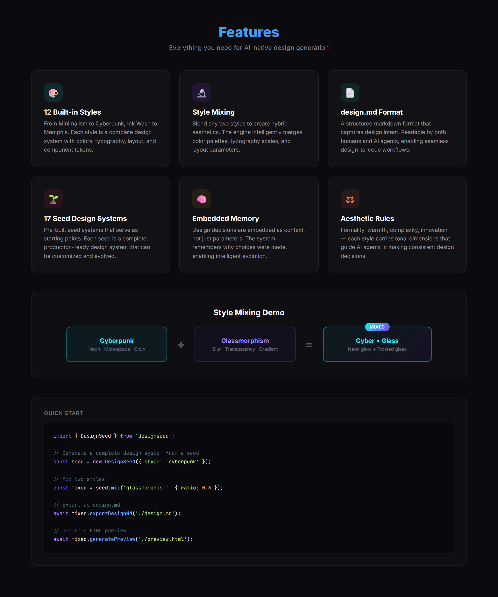
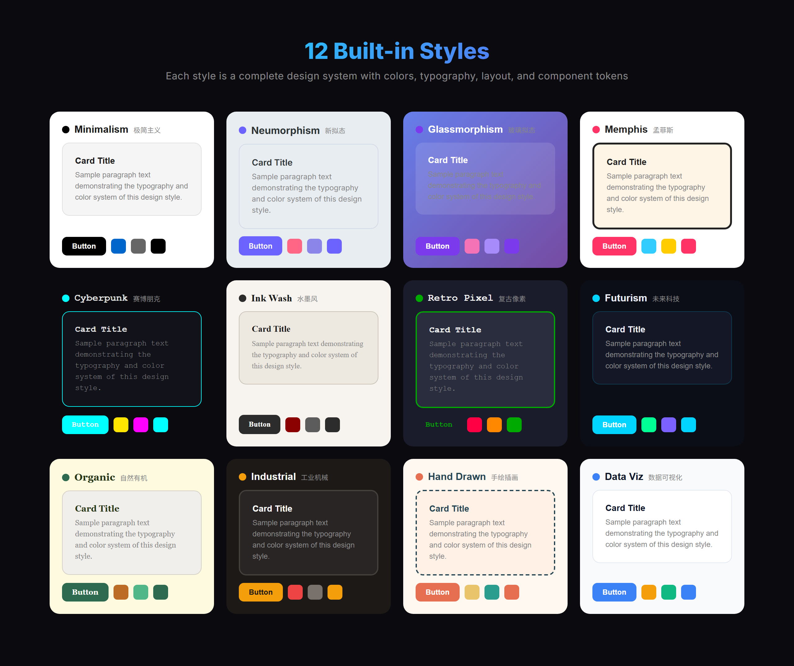

# DesignSeed 🌱

> 🌱 This is a **Vibe Coding** project: Built with AI, for AI-augmented development.


<p align="center"><b>English</b> | <a href="README.md"><b>中文</b></a></p>

<p align=center>
  
</p>

**DesignSeed** is the AI Design System That Grows — an Agent-first HTML design engine that gives AI assistants "aesthetic" capabilities.

Its core value: **making AI-generated pages no longer generic black-on-white, but designed works with style, tone, and memory.**

---

<p align="center">
  
</p>

## ✨ Core Features

### Foundation

| Feature | Description |
|---------|-------------|
| 🎨 **12 Built-in Styles + Mix Engine** | 12 styles including Minimal, Neumorphism, Glassmorphism, etc. Mix any two styles at a ratio to generate entirely new styles |
| 🏢 **15 Seed Design Systems** | Stripe, Vercel, Apple, Linear, Notion, Figma, Spotify, Airbnb, GitHub, Slack, Netflix, Tesla, Claude, Supabase, Raycast |
| 🕷️ **Design Crawler** | Learn from GitHub repos, company design systems, and design blogs — extract color/typography/layout/tone characteristics |
| 🧠 **Embedded Memory** | Records every generated prompt, style, and user modification to build a design preference profile |
| 🛡️ **Aesthetics Rule Engine** | 7 built-in rules (contrast/font size/line width/color/color blacklist/spacing/border radius) with auto-check and fix |
| 📦 **Self-contained Skill** | Unzip and use — no external services required |
| 🔄 **Bidirectional Sync** | Export as knowledge packs, importable to other Agents or devices |

### v0.3 New Capabilities

| Feature | Description |
|---------|-------------|
| 📱 **Device Frames** | iOS (iPhone 16 Pro/SE/iPad) + Android (Pixel 9 Pro/Samsung S24/Xiaomi 15) pixel-precise device shells |
| 🖥️ **Complex UI Layouts** | Dashboard / Editor / Workshop / Settings / List / Detail — 6 professional layout modes |
| ⚡ **Interaction State Management** | Tab switching / Collapsible panels / Modal popups / Toast notifications / Dropdown menus (pure CSS) |
| 🖼️ **Real Image Sourcing** | Wikimedia Commons + Unsplash API — semantically fetch real images, no more placeholders |
| 🏷️ **Brand Asset Protocol** | Logo / Product images / UI screenshots — 5-step hard process, unofficial assets auto-labeled |
| 💡 **Design Direction Advisor** | 20+ design philosophies (Pentagram/Field.io/Kenya Hara/Sagmeister, etc.) — guide direction when requirements are vague |
| 🔍 **Expert Review Engine** | 5-dimension scoring (philosophy consistency / visual hierarchy / detail execution / functionality / innovation) + fix checklist |
| 🚫 **Anti AI Slop** | 10 check rules to prevent overly "AI-flavored" designs (gradient/emoji/rainbow borders/glassmorphism abuse, etc.) |

### v0.4 New Capabilities

| Feature | Description |
|---------|-------------|
| 📄 **design.md Format** | YAML frontmatter + Markdown sections — standardized design system description format with parse/generate/validate/import/export support |
| 🔗 **Design System Bridge** | design.md → renderer auto-conversion, 17 seed design systems (Stripe/Vercel/Linear/Apple/Notion/Figma/Spotify/Airbnb/GitHub/Slack/Netflix/Tesla/Claude/Supabase/Raycast/Discord/Tailwind) |
| 🕷️ **CSS Variable Extractor** | Extract custom properties from CSS/HTML/JSX, parse var() reference chains, map to design token semantics |
| 🧩 **Component Library Detector** | Auto-detect 12 UI frameworks including Tailwind/Bootstrap/MUI/Ant Design/Chakra/Shadcn/Radix |
| 🎯 **End-to-end Demo** | `node demo.js "requirement" --style stripe` — one command generates a complete HTML page (1-6ms) |


---

## 🏗️ Architecture Overview

```
DesignSeed/
├── engine/              # 🎨 HTML Design Engine
│   ├── cli.js           #   CLI Entry
│   ├── renderer.js      #   Prompt → HTML Renderer
│   ├── mixer.js         #   Style Mix Engine (Vector Interpolation)
│   ├── seed-design-systems.js  # 15 Seed Design System Data
│   ├── device-frames.js #   📱 Device Frames (iOS/Android/Tablet)
│   ├── layouts.js       #   🖥️ Complex UI Layouts (6 Modes)
│   ├── interactions.js  #   ⚡ Interaction States (Tab/Modal/Accordion)
│   ├── image-sourcing.js#   🖼️ Real Images (Wikimedia/Unsplash)
│   ├── brand-protocol.js#   🏷️ Brand Asset Protocol
│   ├── design-philosophy.js # 💡 Design Direction Advisor (20+ Philosophies)
│   ├── expert-review.js #   🔍 Expert Review Engine
│   ├── anti-ai-slop.js  #   🚫 Anti AI Slop Checks
│   ├── templates/       #   12 Style Definitions
│   └── components/      #   Base UI Component Library
├── crawler/             # 🕷️ Design Crawler
├── memory/              # 🧠 Embedded Memory
├── rules/               # 🛡️ Aesthetics Rule Engine
├── sync/                # 🔄 Sync Layer
└── SKILL.md             # Agent Skill Description
```

---

## 🚀 Quick Start

DesignSeed is an AI Skill — once installed, use it directly in conversation. No commands needed — **just tell the AI what you want in natural language**.

### Generate App Prototypes

> "Build me a task management app interface, displayed in an iPhone 16 Pro device frame"

> "Generate a data analytics dashboard with a sidebar and stat cards"

> "Create a settings page with category navigation on the left and a form on the right"

### Design Direction Exploration

> "I want to build a SaaS product for developers — recommend a design direction"

> "I want a style that's both techy and warm — any suggestions?"

### Style Mixing

> "Build me a landing page, style somewhere between Minimal and Glassmorphism"

> "Make a pricing page in Stripe's style, but switch the colors to green"

### Real Images

> "Build me a team introduction page with real office scene photos"

> "Generate a product showcase page with real phone photos instead of placeholders"

### Design Review

> "Check the design quality of this page for me"

> "Does this page have too much AI flavor?"

### Brand Showcase

> "Build me an Apple-style product comparison page with real logos and product images"

---

## 📱 Device Frames

v0.3 provides pixel-precise device shells:

| Platform | Model | Size | Features |
|----------|-------|------|----------|
| **iOS** | iPhone 16 Pro | 393×852 | Dynamic Island, Home Indicator |
| **iOS** | iPhone 16 | 393×852 | Dynamic Island, Home Indicator |
| **iOS** | iPhone SE | 375×667 | Classic Bezel, Home Button |
| **iOS** | iPad Pro | 1024×768 | Slim Bezel, Home Indicator |
| **Android** | Pixel 9 Pro | 412×915 | Pill Punch-hole, Navigation Bar |
| **Android** | Samsung S24 | 360×780 | Circular Punch-hole, Navigation Bar |
| **Android** | Xiaomi 15 | 400×880 | Circular Punch-hole, Navigation Bar |

---

## 🖥️ Complex UI Layouts

| Layout | Description | Use Cases |
|--------|-------------|-----------|
| **Dashboard** | Sidebar + Stat Cards + Recent Projects | Admin panels, data analytics |
| **Editor** | File Tree + Editor + Preview | Code editors, document editing |
| **Workshop** | Main Workspace + Right Properties Panel | Design tools, IDEs |
| **Settings** | Left Categories + Right Forms | App settings, preferences |
| **List** | Search Bar + Data List/Grid | File management, data browsing |
| **Detail** | Title + Meta Info + Content + Action Bar | Article details, project details |

---

## 💡 Design Direction Advisor

v0.3 includes 20+ design philosophies across 7 schools:

| School | Design Philosophy | Representatives |
|--------|-------------------|-----------------|
| **Information Architecture** | Pentagram / Swiss International Style / Bauhaus | Apple.com, Swiss Airlines |
| **Motion Poetics** | Field.io / Google Material Motion | Stripe, Google |
| **Eastern Minimalism** | Kenya Hara / Wabi-sabi Aesthetics | MUJI, Kyoto Artisans |
| **Experimental Avant-garde** | Sagmeister / Digital Brutalism / Glitch Aesthetics | Sagmeister&Walsh, Craigslist |
| **Warm Humanism** | Warm Humanism / Organic Naturalism | Notion, Patagonia |
| **Tech Futurism** | Cyberpunk / Glassmorphism / Neumorphism | Cyberpunk 2077, macOS |
| **Typographic Excellence** | Typographic Excellence / Editorial Design | The New York Times, Medium |
| **Data-driven** | Data Visualizationism | Grafana, Datadog |
| **Brand Narrative** | Brand Narrativism | Apple Keynote |

---

## 🔍 Expert Review

5-dimension scoring system for automatic design quality assessment:

| Dimension | Weight | Description |
|-----------|--------|-------------|
| Philosophy Consistency | 25% | Whether visual style embodies the design philosophy |
| Visual Hierarchy | 25% | Whether information hierarchy is clear — can you understand the page in 3 seconds? |
| Detail Execution | 20% | Consistency of spacing/alignment/border radius/colors |
| Functionality | 20% | Is information accessible? Are interactions intuitive? |
| Innovation | 10% | Are there highlights? Does it go beyond template feel? |

Rating Scale: S (Excellent) → A (Outstanding) → B+ (Good) → B (Passing) → C (Average) → D (Needs Improvement) → F (Failing)

---

## 🚫 Anti AI Slop

10 automatic checks to prevent overly "AI-flavored" designs:

| Check | Severity | Description |
|-------|----------|-------------|
| Unnecessary Gradients | ⚠️ Warning | Don't use gradients where solid colors suffice |
| Emoji Overload | ⚠️ Warning | Don't pile emojis into headings and buttons |
| Rainbow Borders | 💡 Suggestion | Avoid border-image gradients |
| Excessive Border Radius | 💡 Suggestion | Not everything needs 24px+ rounded corners |
| Glassmorphism Everywhere | ⚠️ Warning | Use backdrop-filter only where transparency is needed |
| Placeholder Text | ❌ Error | Don't use Lorem ipsum or "Click here" |
| Heavy Shadows | 💡 Suggestion | Use lightweight shadows |
| Everything Centered | 💡 Suggestion | Left-align body text; center only for headings/CTAs |
| Neon Color Abuse | ⚠️ Warning | Reduce saturation; use neon colors sparingly |
| Inconsistent Spacing | ⚠️ Warning | Use 4/8px multiples system |

---

<p align="center">
  
</p>

## 🏢 Seed Design Systems

v0.2 ships with characteristic data from 15 leading design systems:

| Design System | Primary Color | Tone Tags |
|---------------|---------------|-----------|
| **Stripe** | `#635BFF` | Professional · Finance · Developer |
| **Vercel** | `#000000` | Minimal · Developer · Dark |
| **Apple** | `#0071E3` | Premium · Minimal · Refined |
| **Linear** | `#5E6AD2` | Modern · Efficient · Professional |
| **Notion** | `#000000` | Minimal · Flexible · Knowledge |
| **Figma** | `#A259FF` | Creative · Collaborative · Design |
| **Spotify** | `#1DB954` | Vibrant · Entertainment · Social |
| **Airbnb** | `#FF5A5F` | Warm · Travel · Community |
| **GitHub** | `#24292E` | Professional · Developer · Open Source |
| **Slack** | `#4A154B` | Friendly · Collaborative · Enterprise |
| **Netflix** | `#E50914` | Entertainment · Film · Dark |
| **Tesla** | `#CC0000` | Tech · Futuristic · Premium |
| **Claude** | `#D97757` | Professional · AI · Reliable |
| **Supabase** | `#3ECF8E` | Developer · Modern · Open Source |
| **Raycast** | `#FF6363` | Productivity · Utility · Geek |

---
## 🕷️ Design Crawler

DesignSeed includes a built-in design crawler that learns from external sources — extracting color, typography, layout, and tone characteristics to generate new design styles for future use.

### Crawl Design Styles

**From GitHub repositories:**

> "Learn design styles from https://github.com/bradtraversy/design-resources-for-developers"

> "Go to Atlassian's design system website and study their design characteristics"

> "Crawl Shopify Polaris's design specs and extract color and typography info"

**From design blogs:**

> "Crawl the latest design trend articles from Smashing Magazine and analyze the color schemes"

> "Check out Design Bootcamp on Medium and extract tone characteristics"

### Use New Styles

After crawling, the crawler automatically extracts the following characteristics and stores them locally:

| Characteristic | Description |
|----------------|-------------|
| 🎨 **Color** | Primary color, secondary color, background color, palette, warm/cool tendency |
| 📝 **Typography** | Font family, font size hierarchy, line height, font weight |
| 📐 **Layout** | Grid system, spacing ratio, max content width |
| 🧩 **Components** | Style characteristics of buttons, cards, navigation, etc. |
| 🎭 **Tone** | Formality, warmth, complexity, innovation level |

**Generate pages using crawled styles:**

> "Use the style I just learned from Atlassian to build a project management page"

> "Mix Stripe and Linear's design characteristics to generate a SaaS landing page"

> "Redesign this page using the color scheme crawled from Smashing Magazine"

### Crawl Workflow

```
1. You say: "Learn design styles from [URL]"
2. Crawler fetches the target page/repository
3. Parser extracts color, typography, layout, and tone characteristics
4. Characteristics are stored locally in memory/design-profiles/
5. Future page generation automatically references these characteristics
```

### Supported Data Sources

| Type | Examples | Description |
|------|----------|-------------|
| **GitHub Repos** | `github.com/user/repo` | Auto-traverse repos, match `DESIGN.md` and other design docs |
| **Company Design Systems** | Atlassian, Carbon, Polaris, Material, Ant Design | Directly crawl design spec websites |
| **Design Blogs** | Smashing Magazine, Medium Design Bootcamp | Extract design cases and color schemes from articles |
| **Local Files** | Your own design documents | Directly read local Markdown/HTML files |

### Batch Learning

> "Batch-learn these 5 design systems: Stripe, Vercel, Linear, Notion, Figma"

> "Crawl all design documents in the awesome-design-md repository"

---

## 🛡️ Aesthetics Rule Engine
7 built-in aesthetics rules:

| Rule | Type | Description |
|------|------|-------------|
| `accessibility_contrast` | hard_limit | Text contrast ratio ≥ 4.5:1 (WCAG 2.1 AA) |
| `min_font_size` | hard_limit | Minimum font size ≥ 12px |
| `max_line_length` | soft_preference | Line width ≤ 80 characters |
| `color_harmony` | hard_limit | No more than 7 primary colors |
| `ugly_combo_clash` | hard_limit | Block high-saturation clashing color combos |
| `spacing_consistency` | soft_preference | Spacing values follow 4/8/12/16/24/32/48/64 scale |
| `border_radius_consistency` | soft_preference | Border radius values follow 0/2/4/8/12/16/24 scale |

---

## 📖 Use Cases

**Scenario 1: App Prototype Design**

> "Build me a task management app Dashboard" → Select iPhone 16 Pro device frame → Dashboard layout → Real images → Generate complete interactive HTML

**Scenario 2: Design Direction Exploration**

> "I want to build a SaaS product for developers" → Design Direction Advisor recommends 3 directions → Select Pentagram Information Architecture → Generate page

**Scenario 3: Design Quality Review**

> After generating a page → Expert Review 5-dimension scoring → Get fix checklist → Auto-fix → Re-review

**Scenario 4: Style Mixing**

> "I want a style between Minimal and Glassmorphism" → Mix at ratio → Generate entirely new style

**Scenario 5: Team Sharing**

> Export knowledge pack → Send to team members → Import → Team AI Agents share the same design preferences

---

## 🗺️ Roadmap

### v0.1 ✅ — MVP Core
- [x] HTML Design Engine: 12 styles, Prompt → HTML
- [x] Design Crawler: multi-source collection, feature extraction
- [x] Embedded Memory: SQLite storage, EMA preference learning
- [x] Aesthetics Rule Engine: 7 built-in rules
- [x] Sync Layer: knowledge pack export/import

### v0.2 ✅ — Style Mixing + Knowledge Accumulation
- [x] Vector space style interpolation
- [x] 15 leading design system seed data
- [x] Auto-fix + user presets

### v0.3 ✅ — Design Capability Enhancement
- [x] Device Frames (iOS/Android/Tablet)
- [x] Complex UI Layouts (6 modes)
- [x] Interaction State Management (Tab/Modal/Accordion/Toast/Dropdown)
- [x] Real Image Sourcing (Wikimedia/Unsplash)
- [x] Brand Asset Protocol (5-step process)
- [x] Design Direction Advisor (20+ design philosophies)
- [x] Expert Review Engine (5-dimension scoring)
- [x] Anti AI Slop (10 checks)

### v0.4 — design.md Format + Creator Foundation ✅
- [x] design.md format specification
- [x] design.md generator / validator / importer
- [x] Design Crawler enhancement (CSS variable extraction + component library detection)
- [x] design.md → renderer bridge
- [x] End-to-end Demo script

### v0.5 — Design Evolution (Planned)
- [ ] Feedback loop (user modifications → Nexus anchor → auto-optimization)
- [ ] Design Crawler in practice (awesome-design-md batch learning)
- [ ] Style Mixing enhancement (cross-system style vector mixing)
- [ ] RuleForge rule integration (aesthetics checks + adaptive weighting)
- [ ] Preference profile (cumulative design choices → design preference portrait)

### v0.6 — Open Interface (Planned)
- [ ] DesignSeed API protocol definition
- [ ] CLI / HTTP / stdio three invocation methods
- [ ] Third-party SDK release
- [ ] Any software/Agent can integrate design capabilities

---

## 🤝 Contributing

```bash
git clone https://github.com/kialajin-l/DesignSeed.git
cd DesignSeed
npm install
```

---

## 📄 License

MIT License

## 🙏 Acknowledgements

- [Claude Design](https://claude.ai) — Inspiration for minimalist aesthetics
- [Xiaomi miclaw](https://github.com/XiaomiMiClaw) — AI assistant platform
- [Model Context Protocol](https://modelcontextprotocol.io/) — Standardized tool protocol for AI Agents
- [Ant Design](https://ant.design) — Enterprise design system reference
- [Material Design](https://m3.material.io) — Google design language reference

---

## 🌟 Star History

[](https://star-history.com/#kialajin-l/DesignSeed&Date)
