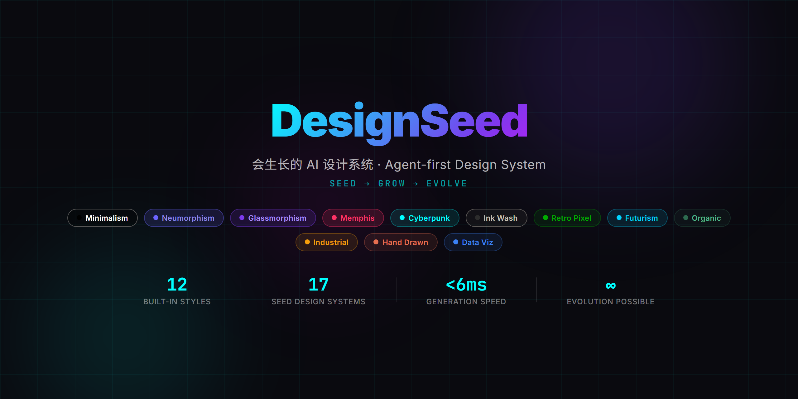
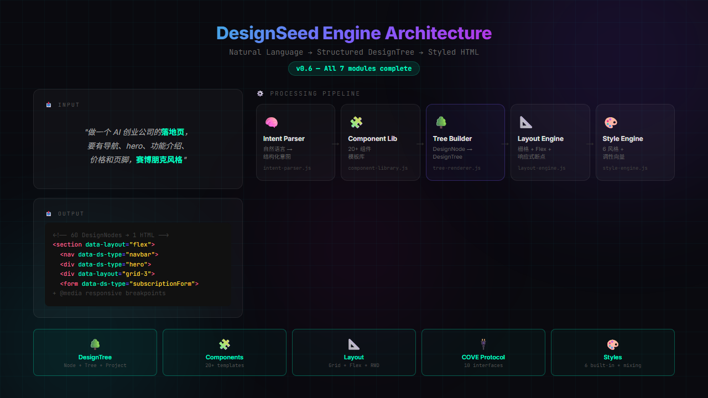
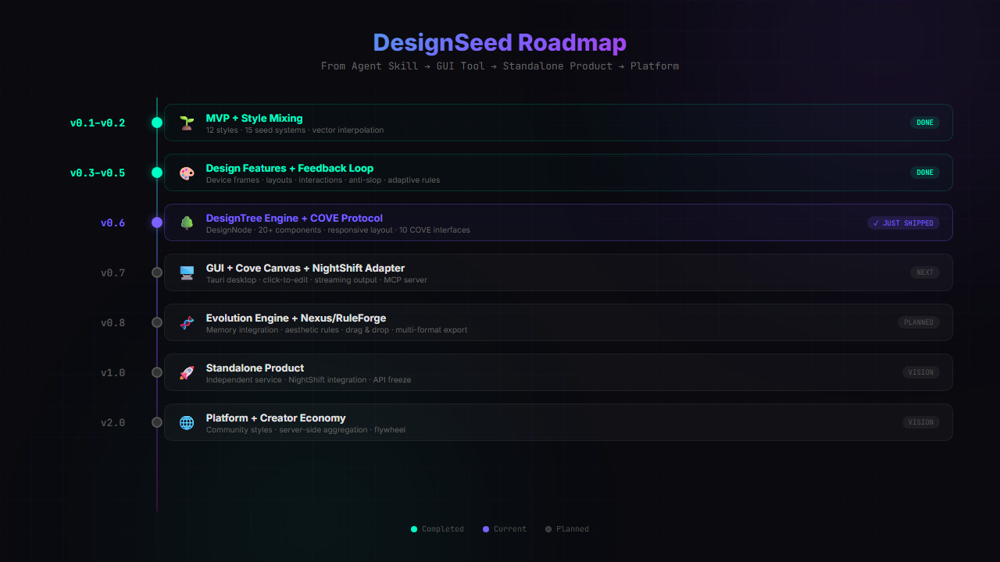

# DesignSeed 🌱

> 🌱 This is a **Vibe Coding** project: Built with AI, for AI-augmented development.


<p align="center"><a href="README.en.md"><b>English</b></a> | <b>中文</b></p>

<p align=center>
  
</p>

**DesignSeed** 是一个会生长的 AI 设计系统——Agent-first 的 HTML 设计引擎，让 AI 助手拥有"审美"能力。

它的核心价值是：**让 AI 生成的页面不再是千篇一律的白底黑字，而是有风格、有调性、有记忆的设计作品。**

---

<p align="center">
  
</p>

## ✨ 核心功能

### 基础能力

| 功能 | 说明 |
|------|------|
| 🎨 **12 种内置风格 + 混合引擎** | 极简、新拟态、玻璃拟态等 12 种风格，支持任意两种风格按比例混合生成全新风格 |
| 🏢 **15 个种子设计系统** | Stripe、Vercel、Apple、Linear、Notion、Figma、Spotify、Airbnb、GitHub、Slack、Netflix、Tesla、Claude、Supabase、Raycast |
| 🕷️ **设计爬虫** | 从 GitHub、公司设计系统、设计博客中学习优秀设计，提取色彩/排版/布局/调性特征 |
| 🧠 **嵌入式记忆** | 记录每次生成的 prompt、风格、用户修改，形成设计偏好档案 |
| 🛡️ **美学规则引擎** | 7 条内置规则（对比度/字号/行宽/色彩/配色黑名单/间距/圆角），自动检查和修复 |
| 📦 **自包含 Skill** | 解压即用，无需外部服务 |
| 🔄 **双向同步** | 导出为知识包，可导入到其他 Agent 或设备 |

### v0.3 新增能力

| 功能 | 说明 |
|------|------|
| 📱 **设备框架** | iOS（iPhone 16 Pro/SE/iPad）+ Android（Pixel 9 Pro/Samsung S24/Xiaomi 15）精确像素级设备外壳 |
| 🖥️ **复杂 UI 布局** | Dashboard / Editor / Workshop / Settings / List / Detail 六种专业布局模式 |
| ⚡ **交互状态管理** | Tab 切换 / 折叠面板 / Modal 弹窗 / Toast 通知 / Dropdown 下拉菜单（纯 CSS 实现） |
| 🖼️ **真实图片 Sourcing** | Wikimedia Commons + Unsplash API，根据语义自动获取真实图片，告别 placeholder |
| 🏷️ **品牌资产协议** | Logo / 产品图 / UI 截图 5 步硬流程，非官方物料自动标注 |
| 💡 **设计方向顾问** | 20+ 种设计哲学（Pentagram/Field.io/Kenya Hara/Sagmeister 等），需求模糊时引导方向 |
| 🔍 **专家评审引擎** | 5 维度评分（哲学一致性/视觉层级/细节执行/功能性/创新性）+ 修复清单 |
| 🚫 **反 AI Slop** | 10 项检查规则，防止生成"AI 味"过重的设计（渐变/emoji/彩虹边框/毛玻璃滥用等） |

### v0.4 新增能力

| 功能 | 说明 |
|------|------|
| 📄 **design.md 格式** | YAML frontmatter + Markdown sections 的标准化设计系统描述格式 |
| 🔗 **设计系统桥接器** | design.md → renderer 自动转换，17 个种子设计系统 |
| 🕷️ **CSS 变量提取器** | 从 CSS/HTML/JSX 中提取自定义属性，映射到设计 token 语义 |
| 🧩 **组件库识别器** | 自动检测 Tailwind/Bootstrap/MUI/Ant Design 等 12 种 UI 框架 |
| 🎯 **端到端 Demo** | node engine/cli.js generate --prompt "需求" --style stripe 一句话生成完整 HTML 页面 |

### v0.6 新增能力

| 功能 | 说明 |
|------|------|
| 🔄 **三通道反馈收集** | 用户评分 + 行为推断 + A/B 对比选择 |
| 📊 **用户偏好档案** | 6 维度画像（色温/正式度/可读性/复杂度/创新度/布局密度），带置信度 |
| 🧬 **规则自适应** | 接受率高→权重↑，被覆盖→权重↓，长期不用→衰减，自动进化 |
| 🔀 **跨系统风格混合** | 内置风格 × 学习风格的混合，自动推荐最佳比例 |
| 📦 **批量学习管道** | 增量学习 + 质量过滤 + 去重，支持批量抓取设计系统 |
| 🌳 **DesignTree 数据结构** | 三层结构：DesignNode → DesignTree → DesignProject，标准化设计产出 |
| 🧩 **20+ 组件模板库** | 导航栏、Hero、功能卡片、价格表、FAQ、时间线、画廊、订阅表单、团队成员、行动号召等 |
| 📐 **响应式布局引擎** | 自动检测 Grid/Flex 布局，生成 768px/480px 两个断点的媒体查询 |
| 🔌 **COVE 协议接口** | 11 个标准化接口：generatePreview / generateTree / getNodeById / updateNode / insertNode / deleteNode / listNodes / exportTree / importTree / generateFragment / listStyles |
| 🧠 **意图解析器** | 自然语言 → 结构化设计意图（页面类型 + 组件列表 + 风格偏好），支持 10+ 页面类型 |
| 🎨 **6 种风格引擎** | minimalism / cyberpunk / warmth / scandinavian / luxury / playful，每种含完整调性向量 |

### 🆕 v0.7 新增能力

| 功能 | 说明 |
|------|------|
| 🎨 **风格包系统** | 可扩展的风格包架构，每个风格包含多个调色板变体（如 cyberpunk:neon-cyan、cyberpunk:neon-magenta） |
| 📦 **StylePackLoader** | 风格包加载器，支持从 `style-packs/` 目录动态加载风格包 |
| 🎯 **调性向量自动推导** | 从风格包的色彩特征自动推导 4 维调性向量（formality/warmth/complexity/innovation） |
| 🔀 **风格包混合** | 支持风格包 ID（如 `cyberpunk:neon-cyan`）参与混合和相似度计算 |
| 📱 **卡片模板系统** | 6 种社交媒体卡片模板（小红书/Instagram/微博/Twitter/LinkedIn/通用），支持风格包渲染 |
| 🔌 **COVE 协议扩展** | 新增 `getStyle`、`getPack`、`listPacks` 接口，支持风格包查询 |
| 🧩 **CLI 风格包命令** | `list`、`mix-pairs`、`card` 命令全面支持风格包 ID |

**v0.7 核心突破**：从"固定风格库"升级为"可扩展风格包系统"，为社区风格市场和用户自定义风格奠定基础。
### 🆕 v0.7.1 CLI 增强

| 功能 | 说明 |
|------|------|
| 🔧 **完整 CLI 工具链** | 10 个命令：generate / screenshot / screenshot-all / demo / list / preset / card / packs / audit / mix |
| 📸 **HTML 截图** | Puppeteer/Playwright 双引擎，支持自定义视口、缩放、格式（PNG/JPEG） |
| 🔍 **设计审计引擎** | 5 维度评分（无障碍/性能/主题一致性/响应式/反模式）+ 修复建议 |
| 🎯 **混合风格语法** | `--style "minimalism:cyberpunk:0.3"` 一句话混合两种风格 |
| ⚡ **快捷选项** | `-p`/`-s`/`-o`/`--ss` 等快捷参数，提升使用效率 |
| 🧪 **CLI Smoke Test** | 5 个自动化测试用例，确保 CLI 稳定性 |

**v0.7.1 核心突破**：从"对话式使用"升级为"CLI 工具链"，支持脚本化、自动化、CI/CD 集成。


---

## 🏗️ 架构概览

```
DesignSeed/
├── engine/              # 🎨 HTML 设计引擎
│   ├── cli.js           #   命令行入口
│   ├── renderer.js      #   Prompt → HTML 渲染器
│   ├── tree-renderer.js #   🌳 DesignNode → HTML 渲染器（v0.6）
│   ├── mixer.js         #   风格混合引擎（向量插值）
│   ├── style-pack-loader.js # 🎨 风格包加载器（v0.7）
│   ├── seed-design-systems.js  # 15 个种子设计系统数据
│   ├── device-frames.js #   📱 设备框架
│   ├── layouts.js       #   🖥️ 复杂 UI 布局
│   ├── interactions.js  #   ⚡ 交互状态
│   ├── image-sourcing.js#   🖼️ 真实图片
│   ├── brand-protocol.js#   🏷️ 品牌资产协议
│   ├── design-philosophy.js # 💡 设计方向顾问
│   ├── expert-review.js #   🔍 专家评审引擎
│   ├── anti-ai-slop.js  #   🚫 反 AI Slop 检查
│   ├── audit.js         #   🔍 设计审计引擎（v0.7.1）
│   ├── cove-protocol.js #   🔌 COVE 协议实现
│   ├── card-templates/  #   📱 卡片模板系统（v0.7）
│   │   ├── index.js     #     模板注册与匹配
│   │   ├── renderer.js  #     卡片渲染器
│   │   └── data/        #     6 种社交媒体卡片模板
│   ├── templates/       #   12 种风格定义
│   └── components/      #   基础 UI 组件库
├── style-packs/         # 🎨 风格包目录（v0.7）
│   └── cyberpunk/       #   示例：赛博朋克风格包
│       ├── pack.json    #     风格包元数据
│       └── palettes/    #     调色板变体
├── crawler/             # 🕷️ 设计爬虫
├── memory/              # 🧠 嵌入式记忆
├── rules/               # 🛡️ 美学规则引擎
├── sync/                # 🔄 同步层
└── SKILL.md             # Agent 技能说明
```

---

## 🚀 快速开始

DesignSeed 是一个 AI 技能（Skill），安装后直接在对话中使用。**用自然语言告诉 AI 你想要什么就行**。

### 生成 App 原型

> "帮我做一个任务管理 App 的界面，用 iPhone 16 Pro 的设备框架展示"

> "生成一个数据分析仪表盘，要有侧边栏和统计卡片"

### 风格混合

> "帮我做一个落地页，风格介于极简和玻璃拟态之间"

> "用 Stripe 的风格做一个定价页面，但颜色换成绿色系"

### 风格包使用

> "用 cyberpunk:neon-cyan 风格生成一个登录页面"

> "混合 cyberpunk:neon-cyan 和 minimalism，比例 7:3"

### 设计评审

> "帮我检查一下这个页面的设计质量"

> "这个页面有没有 AI 味太重的问题？"

---

## 📱 设备框架

| 平台 | 型号 | 尺寸 | 特性 |
|------|------|------|------|
| **iOS** | iPhone 16 Pro | 393×852 | Dynamic Island |
| **iOS** | iPhone SE | 375×667 | 经典边框 |
| **iOS** | iPad Pro | 1024×768 | 窄边框 |
| **Android** | Pixel 9 Pro | 412×915 | Pill 打孔 |
| **Android** | Samsung S24 | 360×780 | 圆形打孔 |
| **Android** | Xiaomi 15 | 400×880 | 圆形打孔 |

---

## 🎨 风格包系统

### 内置风格（12 种）

| 风格 | 调性 | 适用场景 |
|------|------|----------|
| **minimalism** | 极简 · 现代 · 专业 | 企业官网、SaaS 产品 |
| **cyberpunk** | 科技 · 未来 · 暗色 | 游戏、科技产品、NFT |
| **warmth** | 温暖 · 友好 · 自然 | 生活方式、电商、社交 |
| **scandinavian** | 简约 · 自然 · 北欧 | 家居、设计、教育 |
| **luxury** | 高端 · 奢华 · 精致 | 奢侈品、金融、VIP |
| **playful** | 活泼 · 创意 · 趣味 | 儿童、娱乐、创意 |
| **neumorphism** | 柔和 · 立体 · 现代 | 工具类 App、控制面板 |
| **glassmorphism** | 透明 · 模糊 · 时尚 | 登录页、展示页 |
| **brutalism** | 原始 · 大胆 · 反叛 | 艺术、创意机构 |
| **retro** | 复古 · 怀旧 · 温暖 | 咖啡馆、书店、博物馆 |
| **organic** | 自然 · 有机 · 柔和 | 健康、环保、农业 |
| **art-deco** | 装饰 · 复古 · 奢华 | 酒店、剧院、高端品牌 |

### 风格包变体示例

| 风格包 ID | 调色板 | 主色调 |
|-----------|--------|--------|
| `cyberpunk:neon-cyan` | 霓虹青 | `#00FFFF` |
| `cyberpunk:neon-magenta` | 霓虹品红 | `#FF00FF` |
| `cyberpunk:neon-green` | 霓虹绿 | `#39FF14` |
| `cyberpunk:neon-orange` | 霓虹橙 | `#FF6700` |
| `cyberpunk:neon-purple` | 霓虹紫 | `#BF00FF` |
| `cyberpunk:neon-red` | 霓虹红 | `#FF0033` |

---

## 🏢 种子设计系统

| 设计系统 | 主色调 | 调性标签 |
|----------|--------|----------|
| **Stripe** | `#635BFF` | 专业 · 金融 · 开发者 |
| **Vercel** | `#000000` | 极简 · 开发者 · 暗色 |
| **Apple** | `#0071E3` | 高端 · 简约 · 精致 |
| **Linear** | `#5E6AD2` | 现代 · 高效 · 专业 |
| **Notion** | `#000000` | 极简 · 灵活 · 知识 |
| **Figma** | `#A259FF` | 创意 · 协作 · 设计 |
| **Spotify** | `#1DB954` | 活泼 · 娱乐 · 社交 |
| **Airbnb** | `#FF5A5F` | 温暖 · 旅行 · 社区 |
| **GitHub** | `#24292E` | 专业 · 开发者 · 开源 |
| **Slack** | `#4A154B` | 友好 · 协作 · 企业 |
| **Netflix** | `#E50914` | 娱乐 · 影视 · 暗色 |
| **Tesla** | `#CC0000` | 科技 · 未来 · 高端 |
| **Claude** | `#D97757` | 专业 · AI · 可靠 |
| **Supabase** | `#3ECF8E` | 开发者 · 现代 · 开源 |
| **Raycast** | `#FF6363` | 效率 · 工具 · 极客 |

---

## 🛡️ 美学规则引擎

| 规则 | 类型 | 说明 |
|------|------|------|
| `accessibility_contrast` | hard_limit | 文字对比度 ≥ 4.5:1（WCAG 2.1 AA） |
| `min_font_size` | hard_limit | 最小字号 ≥ 12px |
| `max_line_length` | soft_preference | 行宽 ≤ 80 字符 |
| `color_harmony` | hard_limit | 主色调不超过 7 种 |
| `ugly_combo_clash` | hard_limit | 高饱和冲突配色拦截 |
| `spacing_consistency` | soft_preference | 间距值符合 4/8px 倍数系统 |
| `border_radius_consistency` | soft_preference | 圆角值符合标准比例尺 |

---

## 🗺️ Roadmap

<p align="center">
  
</p>

### v0.7.1 ✅ — CLI 增强
- [x] 完整 CLI 工具链：10 个命令，支持脚本化使用
- [x] HTML 截图：Puppeteer/Playwright 双引擎
- [x] 设计审计引擎：5 维度评分 + 修复建议
- [x] 混合风格语法：一句话混合两种风格
- [x] CLI Smoke Test：5 个自动化测试用例

### v0.1 ✅ — MVP 核心
- [x] HTML 设计引擎：12 种风格，Prompt → HTML
- [x] 设计爬虫：多源采集，特征提取
- [x] 嵌入式记忆：SQLite 存储，EMA 偏好学习
- [x] 美学规则引擎：7 条内置规则

### v0
